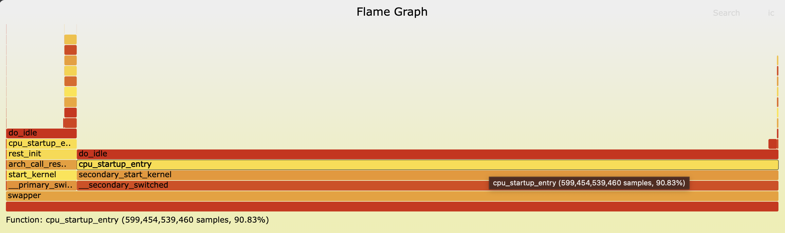

# Flamegraphing

## Get Flamegraph
```
root@15fad6dd8666:/SysPerfLabs/perf-lab/flamegraph# git clone https://github.com/brendangregg/FlameGraph
Cloning into 'FlameGraph'...
remote: Enumerating objects: 1285, done.
remote: Counting objects: 100% (708/708), done.
remote: Compressing objects: 100% (148/148), done.
remote: Total 1285 (delta 584), reused 574 (delta 560), pack-reused 577
Receiving objects: 100% (1285/1285), 1.92 MiB | 575.00 KiB/s, done.
Resolving deltas: 100% (761/761), done.
root@15fad6dd8666:/SysPerfLabs/perf-lab/flamegraph# ls
FlameGraph
```

## Do a perf-record
```
root@15fad6dd8666:/SysPerfLabs/perf-lab/flamegraph# perf record -F 99 -ag -- sleep 60
[ perf record: Woken up 21 times to write data ]
[ perf record: Captured and wrote 6.676 MB perf.data (65340 samples) ]
```

## Generate a flame-graph
```
root@15fad6dd8666:/SysPerfLabs/perf-lab/flamegraph# perf script | FlameGraph/stackcollapse-perf.pl > out.perf-folded
root@15fad6dd8666:/SysPerfLabs/perf-lab/flamegraph# ls
FlameGraph  out.perf-folded  perf.data
root@15fad6dd8666:/SysPerfLabs/perf-lab/flamegraph# cat out.perf-folded | FlameGraph/flamegraph.pl > perf-kernel.svg
```

## Result

